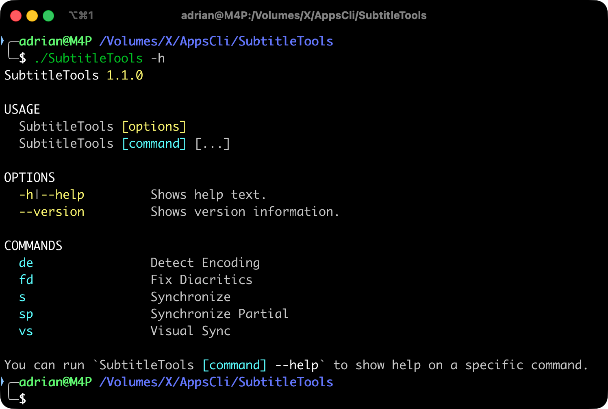

# SubtitleTools CLI

A command-line tool for managing and synchronizing subtitle files.

[](https://codecov.io/gh/S9yN37/SubtitleTools)
---


## Install

```bash
# MacOS
brew tap S9yN37/tap
brew install SubtitleTools

# Arch Linux
yay -S subtitletools-bin
```

## Examples

```bash
# Show general help:
SubtitleTools -h

# Get help for synchronize command:
SubtitleTools s --help

# Convert subtitles to UTF-8:
SubtitleTools c -f Subtitle.srt

# Detect encoding:
SubtitleTools de -f Subtitle.srt

# Synchronize subtitles - shift subtitle 1.5 seconds backward
SubtitleTools s -o -1.5 -f Subtitle.srt

# Partial synchronization - with multiple time segments
# 00:00:00 - 00:00:30 → no synchronization applied
# 00:00:30 - 01:00:00 → shift forward by 1.3 seconds
# 01:00:00 - end      → shift backward by 2 seconds
SubtitleTools sp -s 00:00:30+1.3 -s 00:01:00-2 -f Subtitle.srt

# Visual Sync - using reference points from movie timing:
# --fp: first paragraph number (3) - reference point near start
# --ft: actual time when first paragraph appears in movie (00:00:31.321)
# --lp: last paragraph number (731) - reference point near end
# --lt: actual time when last paragraph appears in movie (01:45:31.123)
# Calculates sync adjustment based on these two reference points
SubtitleTools vs --fp 3 --ft 00:00:31.321 --lp 731 --lt 01:45:31.123 -f Subtitle.srt
```

## Usage

```bash
SubtitleTools [options]
SubtitleTools [command] [...]
```

## Options

- `-h, --help` - Shows help text
- `--version` - Shows version information

## Commands

| Command | Description |
|---------|-------------|
| `de` | Detect Encoding |
| `fd` | Fix Diacritics |
| `s` | Synchronize |
| `sp` | Synchronize Partial |
| `vs` | Visual Sync |

## Help

To get help for a specific command:

```bash
SubtitleTools [command] --help
```

## Version

Current version: 1.1.1
